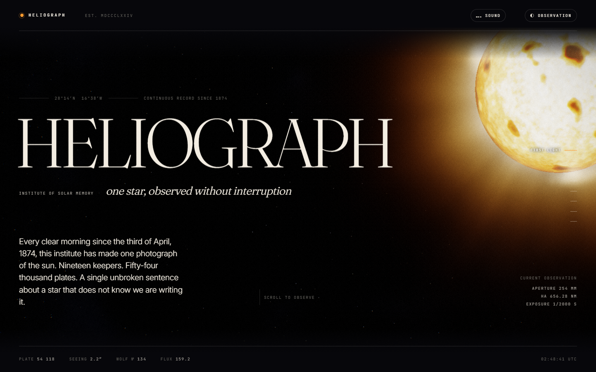
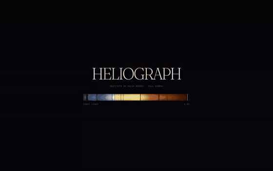

# heliograph

A fictional solar observatory in one HTML file: every visual drawn at runtime, no images, no build step.



**Live:** https://rishsadh.github.io/heliograph/

HELIOGRAPH is the Institute of Solar Memory. It has photographed the sun every clear day since 1874 from Isla Sombra. None of that is true. The institute, the island, the keepers and the archive are invented, and the page says so in its footer: "A fiction, carefully kept."

## What is in it

The page is one scroll with eight stops. All of it is generated by code in `index.html`.

- **The star.** A WebGL2 fragment shader draws the sun behind the whole page: a photosphere with granulation and sunspots, and a corona traced by volumetric raymarching. A short post chain adds bloom, chromatic aberration, tone mapping, vignette and grain. The star changes size and position as you scroll, following a list of poses pinned to each section.
- **Memory.** The manifesto. Its words rise into place as you scroll, with a keeper's note beside it.
- **The Instrument.** A technical drawing of a spectroheliograph in inline SVG. The strokes draw themselves on when the section comes into view. Seven numbered parts can be selected by hover, click or keyboard focus, and each one explains itself in a side panel.
- **The Signature.** A solar absorption spectrum on a 2D canvas. The colours are computed from wavelength, and a table of fifteen named absorption lines is darkened into the band. Drag across it to read the line under the cursor.
- **The Field.** A 2D canvas of particles moving along a magnetic field made from ten alternating poles plus curl noise. Your cursor acts as another pole. It runs while the section is on screen and stops when it is not.
- **The Cycle.** A canvas chart of sunspot number from 1749 to 2025, drawn in as you scroll, with a hover read-out.
- **The Archive.** Six photographic plates, from a white-light disc to a 1905 eclipse, each painted pixel by pixel from seeded noise, then scratched and dusted, with registration marks added. Click one to open it in a lightbox. The plate morphs into place with the View Transitions API where the browser supports it. Arrow keys move between plates and Escape closes.
- **Totality.** The scroll ends on an eclipse, rendered by the same star shader, followed by a colophon.

### Modes

A toggle in the top bar switches between two looks. **Observation** is the dark default. **Archive** is a paper-and-ink version: the shader output is run through a halftone screen, and every canvas redraws in ink tones. Where View Transitions are available, the switch is a circular wipe from the button.

### Sound

There is a **Sound** toggle, off by default. When on, the audio is synthesised with the Web Audio API and nothing is loaded from a file: a low drone, a band of filtered noise that follows how fast you scroll, short ticks on interaction, and a tone for each spectral line you drag across, with pitch scaled from its wavelength.

### Reduced motion

If the browser reports `prefers-reduced-motion: reduce`, CSS transitions and animations are cut to near zero and the scroll reveals show immediately. The script skips the View Transitions and the smooth scroll. It also drops the wordmark weight ripple, the instrument draw-on and the cursor drift.

The render loop stops too. Once the loading screen is done, the page does not run a continuous animation frame loop. The star is drawn as a still with a frozen moment of its animation, and it is redrawn once when the scroll pose, the mode or the window size changes. The field is drawn as one settled still of its streamlines. The UTC clock in the bottom bar keeps ticking on a one second timer.

The file is 2,690 lines and about 131 KB.

## Run it

```sh
git clone https://github.com/rishsadh/heliograph.git
cd heliograph
# then open index.html in a browser with WebGL2
```

There is nothing to install and no server to start. The live copy is at https://rishsadh.github.io/heliograph/.



The GIF was recorded in headless Chromium on software rendering, so it is choppier than the page is on a GPU.

## Why it exists

I built it as a ceiling test for my coding agent: how far it could go on one self-contained page when pushed to its limit. Design and build: Claude Opus 5, directed by Rish Sadh.

## Limits

- **Fonts need a network.** Fraunces, Inter and JetBrains Mono load from Google Fonts. Offline, the page falls back to Georgia and the system fonts, and the layout will shift. Nothing else is fetched.
- **It is heavy on the GPU.** The star shader raymarches up to 44 steps per pixel and runs every frame, followed by a bloom chain of nine draw calls in total. The code lowers the render scale (to as low as 60 percent) and the step count (to 34) when frames run long, and caps pixel ratio at 1.6, but a weak or integrated GPU will still struggle.
- **It does not idle on its own.** With normal motion settings the render loop runs on every animation frame while the tab is visible, including when you are not scrolling. With reduced motion it stops when the page is idle.
- **The field and plates cost CPU.** While the Field section is on screen it moves between 1,000 and 3,400 particles on the CPU each frame. The spectrum is redrawn per pixel on every pointer move. The six plates are redrawn per pixel when you switch modes or resize.
- **Software rendering is slow.** In headless Chromium with SwiftShader instead of a GPU, the loading screen took roughly a minute to clear. The loading screen has a seven second failsafe, but that clock helps little when frames arrive this slowly.
- **Reduced motion is a still, not a slow version.** Under `prefers-reduced-motion` the star and the field are frozen frames, and the star follows the scroll position directly instead of easing toward it. I tested this with Playwright, not with assistive technology.
- **Phones are untested on hardware.** At 360, 390 and 430 px wide the page does not scroll sideways in Chromium's mobile emulation. To fit, the top bar hides its "EST." label and the visible Sound label. I have not tried a real phone.
- **The numbers are scenery.** The sunspot series is generated from a seeded random function shaped to look like a solar cycle. It is not the historical record. I have not audited the astronomy elsewhere on the page either, so do not cite it.
- **No tests.** It is a single file with no test suite. I loaded it in Chromium at 1440 and 390 px wide and watched the console, which stayed clear of errors and warnings.

## Licence

MIT. By [@rishsadh](https://github.com/rishsadh).
